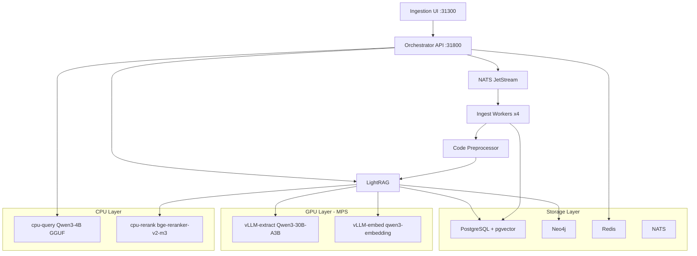
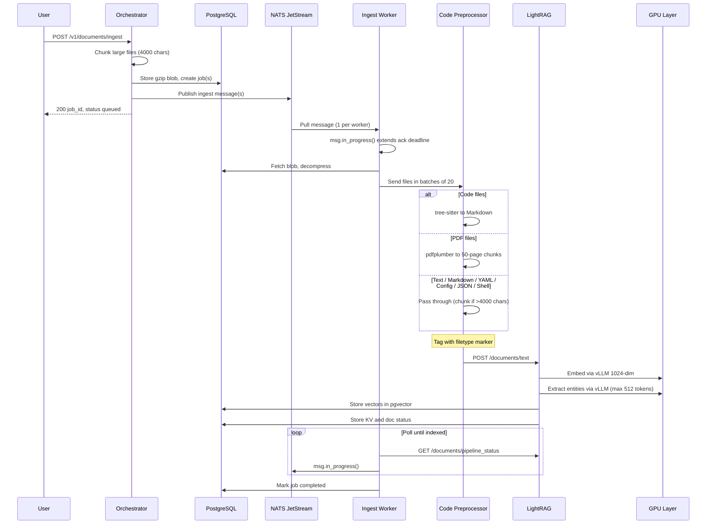
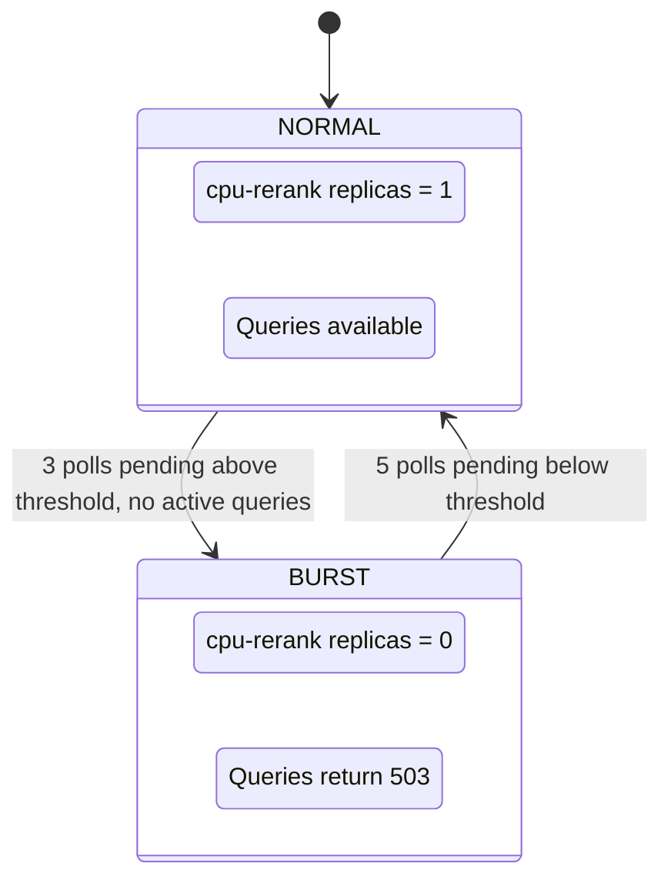

<p align="center">
  
</p>

<h1 align="center">Roadrunner</h1>

<p align="center">A self-hosted GraphRAG pipeline that ingests documents and codebases, builds a knowledge graph, and exposes a structured data query API. Runs on a single NVIDIA DGX Spark (ARM64, GB10) with GPU sharing via MPS.</p>

---

## Overview

Roadrunner turns unstructured content — source code, PDFs, Markdown, plaintext — into a queryable knowledge graph. Code files are parsed with tree-sitter into natural-language descriptions, then embedded and linked as entities and relations in a Neo4j graph backed by pgvector. Large documents are automatically chunked at ingestion time (4000 chars) to prevent processing timeouts. Queries return raw graph subgraphs (entities, relations, source chunks) in an OpenAI-compatible response format, with optional streaming LLM explanations.



## Use Cases

- **Codebase understanding** — Ingest a repository, then query for how components relate, what functions call what, or which modules depend on each other.
- **Documentation search** — Ingest PDFs, Markdown, and text files. Query returns relevant entities, their relations, and source chunks — not just keyword matches.
- **Knowledge base construction** — Build a persistent, structured graph from heterogeneous sources. Each workspace is isolated, so multiple projects or teams can share the same deployment.
- **RAG data layer** — Use the `/v1/data/query` endpoint as a retrieval backend for your own LLM application. Responses follow the OpenAI chat completion format with a `graph` extension field.

## Web UI

The ingestion UI (`http://localhost:31300`) is a full-featured management console built with React 19, Tailwind CSS, and react-force-graph-2d.

### Dashboard

Workspace overview with card-based layout. Each card shows document counts, job status breakdown (queued / processing / completed / failed), and last activity. Click a workspace to switch into it, or delete it with a confirmation dialog. Create new workspaces directly from the dashboard via the inline creation card. Paginated with configurable page size (10 / 25 / 50 / 100).

### Data (Ingest + Jobs + Documents)

Unified data management page combining ingestion, job tracking, and document management in a single view:

- **Drag-and-drop file upload** with automatic type detection — archives (`.tar.gz`, `.zip`) are routed as codebase ingestions, everything else as document ingestions. Supports multi-file and full directory uploads via recursive traversal.
- **Job tracker** with auto-polling. Filter by status (queued, processing, indexing, completed, failed). Retry failed jobs individually or in bulk. Prioritize queued jobs.
- **Document table** merging orchestrator records with LightRAG indexing status into a single status column. Download originals or delete documents — deletion cascades through both the orchestrator DB and the knowledge graph. All columns are sortable with column-level filtering.

### Graph Explorer

Interactive force-directed knowledge graph visualization. Nodes are **color-coded by entity type** (person, organization, technology, function, class, module, file, and more). Total entity and relationship counts are displayed for the workspace. Click any node to inspect its name, type, and description in a detail panel. Zoom, pan, and fit-to-screen controls. **Weight visualization mode** scales node size and link width by chunk count and degree. Search filters the graph instantly via Neo4j text search (sub-second), or load the full top-N graph by degree. **Reconcile** finds disconnected graph clusters and creates bridge edges. Tuned d3-force parameters (adaptive charge strength, link distance, velocity decay) for well-spaced layouts even on large graphs. Labels render only above a zoom threshold to keep the view clean.

### Query

Five query modes in one interface: **vector search** (naive), **vector + graph** (mix), **graph local** (subgraph around matched entities), **graph global** (full traversal), and **graph hybrid**. Results are organized into collapsible sections for chunks (with expandable 300-char previews), entities, and relationships. Hit **Explain** to get a **streaming markdown-rendered LLM explanation** with inline citations (`[1]`, `[2]`, ...) and a numbered sources footer, powered by the dedicated cpu-query instance (Qwen3-4B). SSE keepalive pings maintain the connection during CPU prompt evaluation.

---

## Supported File Types

| Category | Extensions |
|---|---|
| **Code** (tree-sitter) | `.py` `.js` `.jsx` `.mjs` `.cjs` `.ts` `.tsx` `.go` `.rs` `.java` `.c` `.h` `.cpp` `.cc` `.cxx` `.hpp` `.hh` `.hxx` |
| **Documents** | `.pdf` `.md` `.txt` `.rst` `.html` `.htm` |
| **YAML** | `.yaml` `.yml` |
| **Config** | `.ini` `.toml` `.cfg` `.conf` `.env` `.properties` |
| **JSON** | `.json` `.jsonl` `.jsonc` |
| **Shell** | `.sh` `.bash` `.zsh` `.fish` |
| **Archives** (codebase ingest) | `.tar.gz` `.zip` `.tar.bz2` |

Code files get tree-sitter parsing into natural-language Markdown. YAML, config, JSON, and shell files are ingested with filetype-specific extraction prompts tuned for their structure. Documents are passed through directly (PDFs are split into 50-page chunks). Large files exceeding 4000 characters are automatically chunked at ingestion time with each chunk processed as a separate NATS message.

## Prerequisites

- NVIDIA DGX Spark (ARM64 / GB10) or equivalent ARM64 system with NVIDIA GPU
- Ubuntu 22.04+ with NVIDIA drivers
- Ansible 2.15+ installed on the host
- 128 GB unified memory recommended (models + graph + vector store)

## Quickstart

**1. Install Kubernetes and infrastructure:**

```bash
ansible-playbook -i inventory.ini install-k8s.yml
```

This sets up k8s 1.34, containerd, Helm, NVIDIA MPS (4 GPU slices), and Longhorn storage.

**2. Download models:**

```bash
ansible-playbook -i inventory.ini download-models.yml
```

Pre-populates persistent volumes with Qwen3-30B-A3B Q4_K_M GGUF (extraction), Qwen3-4B Q4_K_M GGUF (CPU query), Qwen3-Embedding-0.6B (embedding), and bge-reranker-v2-m3 (reranking).

**3. Deploy the pipeline:**

```bash
ansible-playbook -i inventory.ini deploy-graphrag.yml
```

Builds all container images locally and deploys via Helm. After completion:

| Service | URL |
|---|---|
| **API** | `http://localhost:31800` |
| **Web UI** | `http://localhost:31300` |
| **LightRAG** | `http://localhost:31436` |
| **Neo4j Browser** | `http://localhost:31474` |

**4. Ingest a document:**

```bash
curl -X POST http://localhost:31800/v1/documents/ingest \
  -H "X-Workspace: my-project" \
  -F "file=@README.md"
```

**5. Ingest a codebase:**

```bash
tar czf repo.tar.gz -C /path/to/repo .
curl -X POST http://localhost:31800/v1/codebase/ingest \
  -H "X-Workspace: my-project" \
  -F "file=@repo.tar.gz"
```

**6. Query the knowledge graph:**

```bash
curl -X POST http://localhost:31800/v1/data/query \
  -H "Content-Type: application/json" \
  -d '{"query": "How does authentication work?", "workspace": "my-project"}'
```

## API Reference

### Ingestion

| Method | Endpoint | Description |
|---|---|---|
| `POST` | `/v1/documents/ingest` | Upload a single file. Set workspace via `X-Workspace` header. Large files are auto-chunked (4000 chars). |
| `POST` | `/v1/codebase/ingest` | Upload a `.tar.gz` / `.zip` archive. Filters out dotfiles, `node_modules`, binaries; max 2000 files. |
| `GET`  | `/v1/jobs/{job_id}` | Poll ingestion job status. |
| `GET`  | `/v1/jobs?workspace=X&status=Y` | List jobs, optionally filtered. |
| `POST` | `/v1/jobs/{job_id}/retry` | Retry a single failed job. |
| `POST` | `/v1/jobs/retry-failed?workspace=X` | Retry all failed jobs in a workspace. |
| `POST` | `/v1/jobs/{job_id}/prioritize` | Move a queued job to the priority queue for faster processing. |

### Query

| Method | Endpoint | Description |
|---|---|---|
| `POST` | `/v1/data/query` | Query the knowledge graph. Returns entities, relations, and source chunks. Returns 503 during burst ingestion mode. |
| `POST` | `/v1/data/explain` | Query the graph then stream a markdown-formatted LLM explanation via SSE with numbered source citations. |
| `POST` | `/v1/data/reconcile` | Find disconnected graph clusters and create BRIDGE_TO edges to the main component using pgvector similarity. |
| `GET`  | `/v1/data/weights?workspace=X` | Return blended weights (chunk count + degree) for entities and geometric-mean weights for relations. |

**Request body:**

```json
{
  "query": "What modules handle user input?",
  "workspace": "my-project",
  "mode": "hybrid"
}
```

**Response** (OpenAI chat completion format + `graph` extension):

```json
{
  "id": "chatcmpl-abc123",
  "object": "chat.completion",
  "model": "graphrag",
  "choices": [{
    "message": {
      "role": "assistant",
      "content": "Entities:\n- [MODULE] InputHandler: Processes raw user input...\n\nRelations:\n- InputHandler -> Validator: validates input before processing..."
    }
  }],
  "graph": {
    "entities": [{"entity_name": "InputHandler", "entity_type": "MODULE", "description": "..."}],
    "relations": [{"src_id": "InputHandler", "tgt_id": "Validator", "description": "..."}],
    "chunks": [{"content": "class InputHandler:\n    ..."}]
  }
}
```

### Graph

| Method | Endpoint | Description |
|---|---|---|
| `GET` | `/v1/graph/top?workspace=X&limit=N` | Return top N nodes by degree with their edges from Neo4j. Includes total entity/relationship counts. |
| `GET` | `/v1/graph/search?workspace=X&q=TEXT` | Search graph nodes by name/description. Sub-second Neo4j text search with edges. |

### Workspace Management

| Method | Endpoint | Description |
|---|---|---|
| `GET` | `/v1/workspaces` | List all workspaces with document/job counts. |
| `DELETE` | `/v1/workspaces/{name}` | Delete a workspace and all its data (orchestrator DB + LightRAG graph). |

### Document Management

| Method | Endpoint | Description |
|---|---|---|
| `GET` | `/v1/documents/{doc_id}/download` | Download the original file. |
| `DELETE` | `/v1/documents/{doc_id}` | Delete a document and its graph entries (cascades to LightRAG). |

### Internal

| Method | Endpoint | Description |
|---|---|---|
| `GET` | `/internal/query-activity` | Check query activity status (used by queue-scaler for burst mode coordination). |

## Multi-Tenancy

Workspaces provide full data isolation. Set the workspace via:

1. `workspace` field in the request body (highest priority)
2. `X-Workspace` HTTP header
3. `"default"` if neither is set

Each workspace gets its own graph namespace in Neo4j, vector partition in pgvector, and document/job records in PostgreSQL.

## Architecture

### Ingestion Pipeline



1. **Orchestrator** receives the upload, auto-chunks large files (>4000 chars) into separate documents and jobs, gzip-compresses each blob into PostgreSQL, creates job records, and publishes NATS JetStream messages. Priority messages use the `ingest.priority.document` subject.
2. **Ingest workers** (4 replicas, `fetch_batch=1`) pull from NATS one message at a time. Each worker calls `msg.in_progress()` during polling to extend the 600-second ack deadline and prevent redelivery. Workers fetch the blob, decompress, and split files. Codebases are extracted from archives with filtering (skip dotfiles, `node_modules`, `__pycache__`, binaries; 1 MB/file limit; 2000 file cap).
3. **Code preprocessor** (2 replicas) parses code files via tree-sitter into natural-language Markdown descriptions. PDFs are split into 50-page chunks via pdfplumber. Large text is chunked at 4000 characters. All files are tagged with a `<!-- filetype:xxx -->` marker (code, yaml, config, json, bash, or text) before forwarding.
4. **LightRAG** receives the processed text, embeds it via vLLM (Qwen3-Embedding-0.6B, 1024-dim), and extracts entities and relations via vLLM (Qwen3-30B-A3B Q4_K_M, max 512 tokens) using filetype-specific prompts, examples, and entity types. Internal chunk size is 4000 tokens to avoid double-chunking pre-chunked documents. Results are stored in pgvector + Neo4j.
5. **Ingest worker** polls LightRAG's `/documents/track_status` until indexing completes (round-trip), calling `msg.in_progress()` each poll cycle to keep the NATS ack deadline alive. Jobs show accurate final status rather than staying in "indexing".

### Burst Mode

When the ingestion queue backs up, the queue-scaler automatically frees CPU resources for throughput:



### GPU / CPU Layout

The extraction and embedding models run on GPU via MPS. Query and reranking run on CPU to free GPU memory for ingestion throughput.

| Service | Model | Runtime | Purpose |
|---|---|---|---|
| vLLM-extract | Qwen3-30B-A3B (Q4_K_M GGUF) | GPU (MPS, 0.50 util) | Entity/relation extraction |
| vLLM-embed | Qwen3-Embedding-0.6B | GPU (MPS, 0.03 util) | 1024-dim document embedding |
| cpu-query | Qwen3-4B (Q4_K_M GGUF) | CPU (llama-cpp-python) | LLM explanations for queries |
| cpu-rerank | bge-reranker-v2-m3 | CPU (sentence-transformers) | Query result reranking |

### Storage

| Store | Role |
|---|---|
| **PostgreSQL + pgvector** | Document blobs, job records, vector embeddings (HNSW), LightRAG KV/doc status |
| **Neo4j** | Knowledge graph (entities, relations) |
| **Redis** | Query activity tracking |
| **NATS JetStream** | Ingestion job queue (workqueue retention, 3 retries, 600s ack timeout, priority subject support) |

## Configuration

All model and pipeline settings live in `group_vars/k8s.yml`. To swap a model, change its entry there — playbooks and Helm overrides derive from this single source of truth.

```yaml
models:
  extract:
    tag: "Qwen/Qwen3-30B-A3B"
    source: gguf
    gguf_repo: "unsloth/Qwen3-30B-A3B-Instruct-2507-GGUF"
    gguf_file: "Qwen3-30B-A3B-Instruct-2507-Q4_K_M.gguf"
    served_model_name: "qwen3-30b-a3b-extract"
    num_ctx: "16384"
  query_cpu:
    tag: "Qwen/Qwen3-4B"
    source: gguf
    gguf_repo: "unsloth/Qwen3-4B-GGUF"
    gguf_file: "Qwen3-4B-Q4_K_M.gguf"
  embed:
    tag: "Qwen/Qwen3-Embedding-0.6B"
    source: huggingface
  reranker:
    tag: "BAAI/bge-reranker-v2-m3"
    source: huggingface

graphrag:
  ingest_worker_replicas: 4
  code_preprocessor_replicas: 2
  llmMaxTokens: 512              # extraction token limit per chunk
  chunkSize: 4000                # LightRAG internal chunk size (tokens)
  maxAsync: 16                   # concurrent LightRAG extraction tasks
  queue_scaler:
    poll_interval: 15
    burst_threshold: 10
    burst_hysteresis_up: 3
    burst_hysteresis_down: 5
```

Additional test models for benchmarking are defined under `test_models:` in the same file. Download them with `-e download_test_models=true`.

Helm values are in `charts/graphrag/values.yaml` for fine-grained resource limits, storage sizes, and JVM tuning.

## Teardown

```bash
ansible-playbook -i inventory.ini remove-graphrag.yml   # uninstall Helm chart + images
ansible-playbook -i inventory.ini remove-k8s.yml        # remove k8s, containerd, Longhorn
```

## Project Structure

```
├── apps/
│   ├── orchestrator/        # FastAPI — API gateway, ingestion, data query, graph search
│   ├── ingest-worker/       # Async NATS consumer, document processing
│   ├── code-preprocessor/   # Tree-sitter parsing, PDF extraction, text chunking
│   ├── lightrag/            # Patched LightRAG with multi-workspace support
│   ├── ingestion-ui/        # React 19 / Vite / Tailwind management UI
│   ├── cpu-query/           # Qwen3-4B GGUF via llama-cpp-python (query LLM)
│   ├── cpu-rerank/          # bge-reranker-v2-m3 via sentence-transformers (reranking)
│   └── queue-scaler/        # NATS queue-depth auto-scaler
├── charts/graphrag/         # Helm chart (all k8s resources)
├── group_vars/k8s.yml       # Model + pipeline config (single source of truth)
├── install-k8s.yml          # Ansible: k8s + GPU MPS + Longhorn
├── download-models.yml      # Ansible: pre-populate model PVCs
├── deploy-graphrag.yml      # Ansible: build images + helm install
├── remove-graphrag.yml      # Ansible: teardown pipeline
├── remove-k8s.yml           # Ansible: teardown k8s
└── static/                  # Logo, test docs, benchmarks, evaluation results
```
